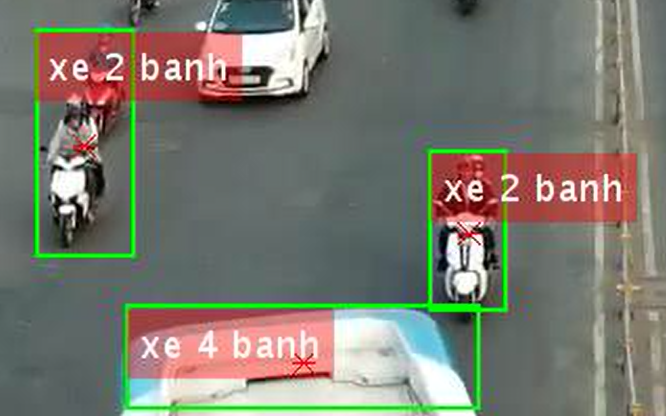

# Image Processing
**Author: Le Quang Huy - 1511234 - Ho Chi Minh University Of Technology.**

Image Processing using featuring extraction method HOG, classify method SVM combined with Neural_network.

This project is used for the topic: VEHICLES DETECTING ON TRAFFIC VIDEO IN VIET NAM.

```
Using Matlab.
```
## This project includes:
### Matlab code.
### Dataset.
### File powerpoint.
### Report (build by Latex).
### Result:

     
